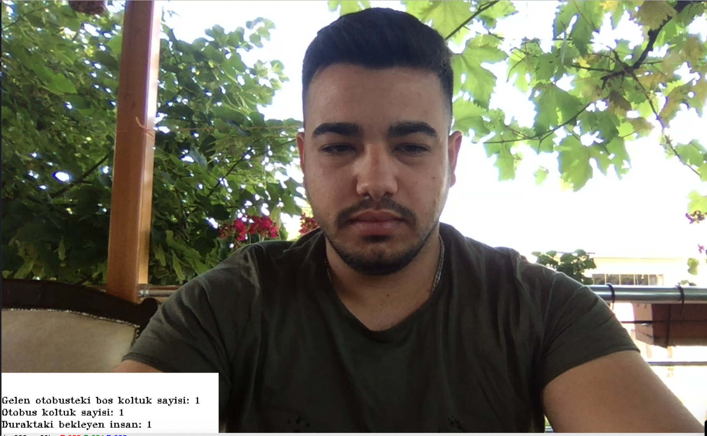

# Nedir?

Otobüs durağında bekleyen kişi sayısına göre gelen otobüsteki boş koltukları doldurup doldurmayacağı ve ihtiyaç durumunda yeni otobüs kaldırılmasına imkan sağlayan uygulama.

# Kullanımı

```py
    python face_detect_camerar.py
```
